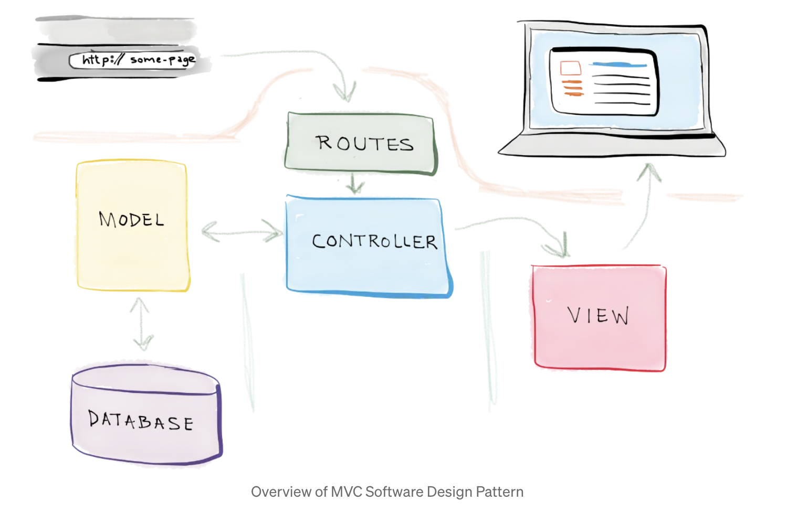
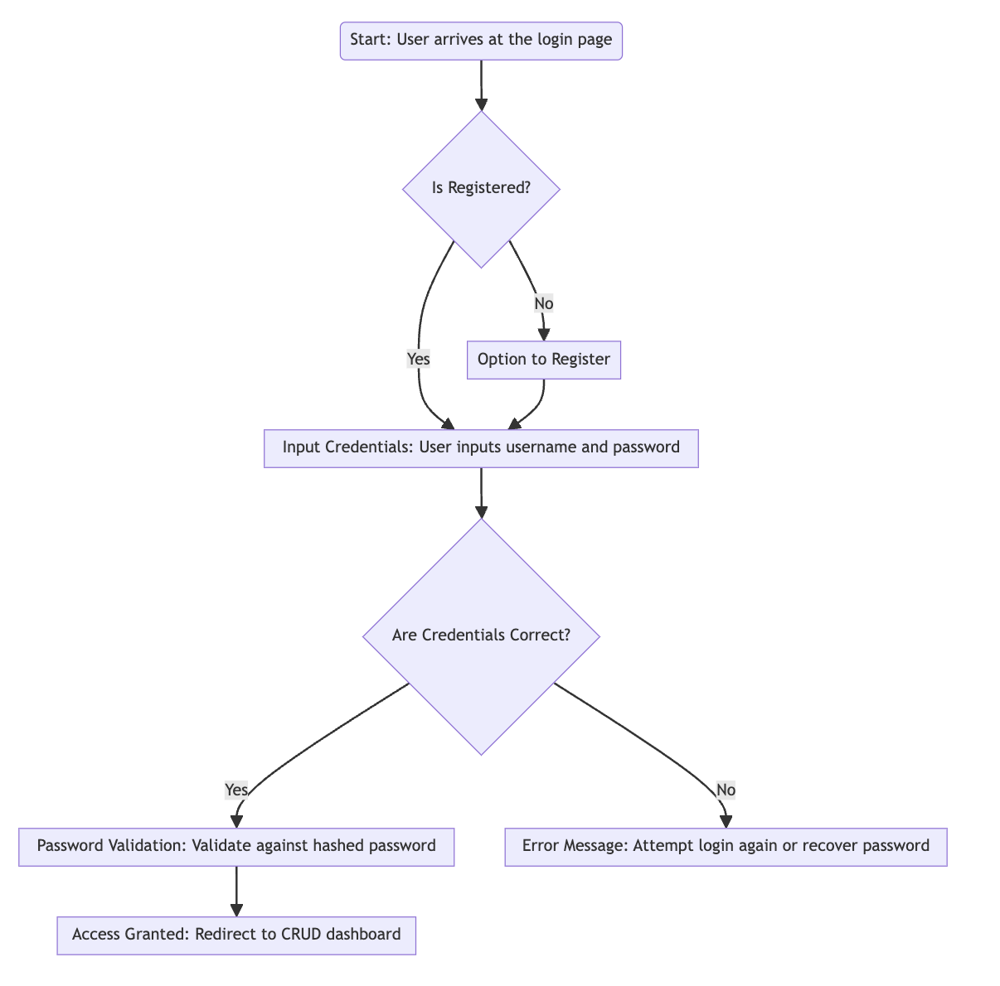
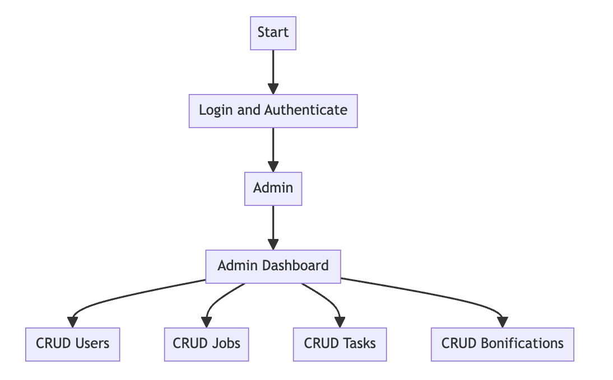

Web Engineering - User Management System
This project forms the foundational phase of system development, integrating essential functionalities that allow users to interact effectively with the platform. It supports user registration, login, and extensive user management features. Authenticated users can perform CRUD (Create, Read, Update, Delete) operations on user data, delivering a robust and efficient user management experience.

Introduction
This web application represents a comprehensive solution designed to manage and secure user data effectively. Utilizing Flask as the server framework and SQLite for database management, this project focuses on creating a secure environment where user interactions are both safe and efficient. The system employs hashed passwords and cookies to ensure that routes and user sessions are securely managed, providing a reliable and user-friendly interface for administrative tasks.

Technologies Being Used
Backend
Flask: Serves as the backbone of the web application, handling requests and responses, routing, and server-side logic.
SQLite: Used for database management, it stores and retrieves all user data as requested by the application logic, ensuring robust data handling.
Frontend
The project utilizes HTML, CSS, and JavaScript to deliver a responsive and intuitive user interface, providing users with a seamless interaction experience.

Security
Hashed Passwords: To enhance security, the application implements hashed passwords, ensuring that user credentials are stored securely in the database.
Cookies: Used for managing sessions and maintaining user state across different pages of the application.
Packages
Flask-Login: Manages user authentication, providing tools for logging in and out users from the application.
Flask-Migrate: Used for handling SQLAlchemy database migrations for Flask applications.
Flask-Bcrypt: Provides hashing utilities for Flask applications to help safely store user passwords.
MVC Architecture
The project follows the MVC (Model-View-Controller) architectural pattern, which separates the application logic into three interconnected components. This pattern helps in organizing the codebase, making it more modular and easier to maintain.

Model
The Model represents the data layer of the application. It defines the structure of the database and includes the logic for retrieving and storing data.

Models: User, Task, Job, Status
Database: SQLite

View
The View represents the presentation layer of the application. It is responsible for rendering the user interface and displaying the data retrieved from the model.

Templates: HTML files that render the user interface (e.g., users.html, jobs.html, tasks.html, bonificacion.html)

Controller
The Controller handles the input from the user, processes it, and returns the appropriate output. It acts as an intermediary between the Model and the View.

Controllers: user_controller.py, task_controller.py, job_controller.py, status_controller.py, bonificacion_controller.py, login_controller.py

Routes --> app.py
Routes define the URL patterns and map them to the respective controllers. They determine what code to execute when a user accesses a specific URL.

Login
This version substantially enhances the security framework of the system by integrating a sophisticated login mechanism. Instead of using JWT, this system employs hashed passwords for verifying user credentials, ensuring that stored passwords are not in plain text, thereby fortifying the security against unauthorized access.

To login:

user: admin
password: admin

Admin
Admin Dashboard
The Admin has the capability to perform CRUD operations on Users, Jobs, Tasks, and Bonifications. Each section (Users, Jobs, Tasks, Bonifications) will have its own interface for creating, reading, updating, and deleting entries.

